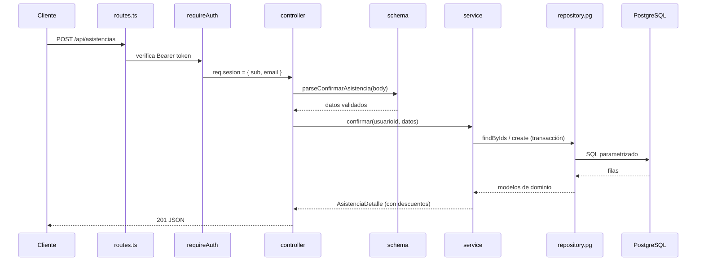
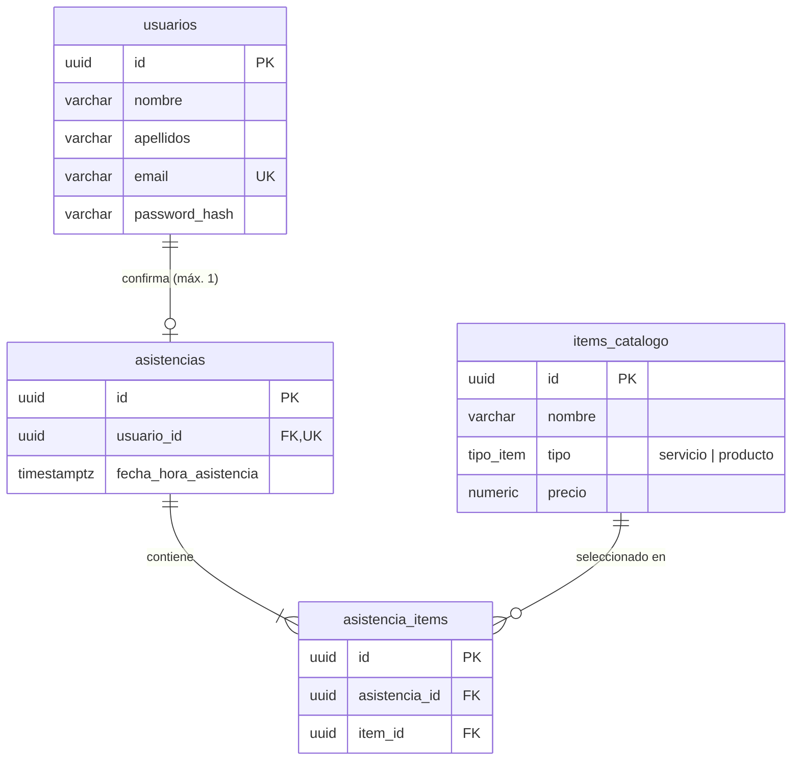

# Backend

API REST de la plataforma. Express 5 + TypeScript sobre PostgreSQL (Neon), sin ORM.

## Arquitectura

El código está organizado **por módulos** y, dentro de cada módulo, **por capa**. Se eligió esta arquitectura debido a la necesidad de mantener un código mantenible y escalable, a la vez de permitir una fácil prueba y mantenimiento.

```
src/
├── index.ts              arranque del servidor y apagado ordenado
├── app.ts                configuración de Express (CORS, JSON, rutas, errores)
├── config/env.ts         lectura y validación de variables de entorno
├── db/
│   ├── pool.ts           pool de conexiones, query() y withTransaction()
│   ├── types.ts          tipos de las filas tal como salen de PostgreSQL
│   └── migrations/       SQL de creación (up/down) y seed del catálogo
├── shared/
│   ├── crypto/           hash de contraseñas (scrypt) y firma/verificación JWT
│   ├── http/             errores tipados, error handler y validadores comunes
│   └── middleware/       requireAuth
└── modules/
    ├── routes.ts         monta los routers de cada módulo bajo /api
    ├── usuarios/
    ├── auth/
    ├── items/
    └── asistencias/
```

### Capas de un módulo

```
modules/<modulo>/
├── domain/           modelos, interfaz del repositorio, errores y reglas puras
├── application/      servicios: casos de uso, orquestan dominio + repositorio
├── infrastructure/   implementación del repositorio contra PostgreSQL
├── http/             schema (validación del request), controller y routes
└── index.ts          composition root: instancia y conecta las capas
```

| Capa | Responsabilidad | Depende de |
|---|---|---|
| **domain** | Tipos del negocio, contratos (`*Repository`), errores de dominio y lógica pura como `calcularDescuentos`. No sabe de HTTP ni de SQL. | nada |
| **application** | Casos de uso (`registrar`, `login`, `cotizar`, `confirmar`…). Traduce errores de dominio a errores HTTP. | domain |
| **infrastructure** | Repositorios `*Pg`: SQL parametrizado, mapeo `snake_case → camelCase`, traducción de errores de PostgreSQL a errores de dominio. | domain, db |
| **http** | `schema.ts` valida y normaliza el body/query; `controller.ts` llama al servicio y responde; `routes.ts` declara rutas y middlewares. | application |
| **index.ts** | Único archivo que conoce las cuatro capas. Cambiar de base de datos = cambiar aquí qué repositorio se instancia. | todas |

La dependencia siempre apunta hacia adentro: `http → application → domain ← infrastructure`. Los servicios reciben el repositorio por constructor como interfaz, no como clase concreta, lo que permite probarlos sin base de datos.

### Flujo de una petición



### Manejo de errores

Todos los errores esperados extienden `AppError` ([shared/http/errors.ts](src/shared/http/errors.ts)) con su código HTTP: `BadRequestError` (400), `UnauthorizedError` (401), `NotFoundError` (404), `ConflictError` (409). El `errorHandler` global los serializa como `{ "error": "mensaje" }`; cualquier otra excepción se registra y responde 500 sin filtrar detalles.

Express 5 propaga automáticamente los rechazos de promesas en handlers `async`, por lo que no hace falta envolver los controllers.

### Sesión

Autenticación stateless con JWT firmado con `JWT_SECRET`. El token viaja en `Authorization: Bearer <token>`; `requireAuth` lo verifica y deja el payload en `req.sesion`. Tanto el registro como el login devuelven `{ token, usuario }`, así el cliente queda autenticado inmediatamente después de registrarse.

## Modelo de datos



- Un usuario solo puede confirmar una vez (`ux_asistencias_usuario`); un segundo intento responde 409.
- La asistencia y sus items se insertan en una sola transacción.
- Todas las tablas tienen `created_at` / `updated_at` mantenidos por trigger.

## Endpoints

Base: `/api`

| Método | Ruta | Auth | Body | Respuesta |
|---|---|---|---|---|
| GET | `/health` | — | — | `{ ok: true }` |
| GET | `/items?q=&tipo=` | — | — | `Item[]` filtrados por nombre (`q`) y/o `tipo` (`servicio` \| `producto`) |
| GET | `/items/:id` | — | — | `Item` |
| POST | `/asistencias/cotizar` | — | `{ itemIds }` | `{ items, descuentos }` — calcula sin guardar |
| POST | `/usuarios` | — | `{ nombre, apellidos, email, password }` | `201 { token, usuario }` |
| POST | `/auth/login` | — | `{ email, password }` | `{ token, usuario }` |
| GET | `/auth/me` | Bearer | — | `Usuario` |
| POST | `/asistencias` | Bearer | `{ fechaHoraAsistencia, itemIds }` | `201 AsistenciaDetalle` |
| GET | `/asistencias/me` | Bearer | — | `AsistenciaDetalle` |

### Flujo esperado desde el frontend

1. `GET /items` para llenar el buscador.
2. Cada vez que cambia la selección, `POST /asistencias/cotizar` para mostrar el descuento en vivo.
3. Al pulsar *Confirmar asistencia*: `POST /usuarios` (obtiene token) y luego `POST /asistencias` con ese token y los mismos `itemIds`.

`confirmar` reutiliza internamente `cotizar`, por lo que el descuento mostrado antes de confirmar es exactamente el que se persiste.

### Forma de `descuentos`

```json
{
  "servicios":  { "cantidad": 2, "subtotal": 1750, "porcentaje": 5, "descuento": 87.5, "total": 1662.5 },
  "productos":  { "cantidad": 3, "subtotal": 300,  "porcentaje": 3, "descuento": 9,    "total": 291 },
  "subtotal": 2050,
  "descuentoTotal": 96.5,
  "total": 1953.5
}
```

Las reglas viven en [modules/asistencias/domain/descuentos.ts](src/modules/asistencias/domain/descuentos.ts) y están cubiertas por [descuentos.test.ts](src/modules/asistencias/domain/descuentos.test.ts).

## Puesta en marcha

Requisitos: Node 22+, pnpm 12.

```bash
pnpm install
```

Variables de entorno en `backend/.env`:

| Variable | Requerida | Descripción |
|---|---|---|
| `DB_POSTGRES` | sí | Cadena de conexión a PostgreSQL |
| `JWT_SECRET` | sí | Mínimo 32 caracteres |
| `JWT_EXPIRES_IN` | no | Duración del token (por defecto `8h`) |
| `PORT` | no | Puerto HTTP (por defecto `3000`) |
| `CORS_ORIGIN` | no | Origen permitido (por defecto `*`) |

Base de datos: ejecutar [`src/db/migrations/001_init.up.sql`](src/db/migrations/001_init.up.sql) y después [`seed.sql`](src/db/migrations/seed.sql) para cargar el catálogo.

```bash
pnpm db:ping   # comprueba la conexión
pnpm dev       # servidor con recarga en http://localhost:3000
pnpm test      # tests unitarios
pnpm build     # compila a dist/
pnpm start     # ejecuta dist/index.js
```
